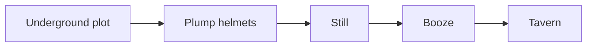

# CLAUDE.md

Guidance for Claude Code sessions working in this repository.

## Purpose

A documentation site for Dwarf Fortress strategy notes, covering both **vanilla DF** (Steam release / Classic) and **DFHack** (current stable). Built with [Material for MkDocs](https://squidfunk.github.io/mkdocs-material/) and deployed to GitHub Pages.

Live site: https://dwarfjockey.github.io/dwarf-fortress-strategies/
Source: https://github.com/DwarfJockey/dwarf-fortress-strategies

## Stack

- **MkDocs** + **Material for MkDocs** theme
- Python deps managed by **uv** (`pyproject.toml`, `uv.lock`)
- Pages auto-deploy on push to `main` via `.github/workflows/docs.yml`

## Local commands

```sh
uv sync                       # install/update deps into .venv
uv run mkdocs serve           # live preview at http://127.0.0.1:8000
uv run mkdocs build --strict  # what CI runs; fails on broken links / orphan pages
```

## Adding a page

1. Create `docs/<section>/<slug>.md`.
2. Register it under `nav:` in `mkdocs.yml`. CI builds with `--strict`, so unreferenced pages and broken internal links fail the build.
3. Cross-link to related pages with relative Markdown links — `[strange moods](../moods/strange-moods.md)` — not absolute URLs.

## Writing conventions

### Vanilla vs. DFHack

When a topic has both a vanilla and a DFHack approach, present them in tabs so the reader can pick:

````markdown
=== "Vanilla"

    Manual procedure using only base-game UI.

=== "DFHack"

    `command-name` from DFHack stable. Link to https://docs.dfhack.org/en/stable/...
````

If a section is DFHack-only, put it under `docs/dfhack/` rather than mixing it into a vanilla page.

### Admonitions

- `!!! tip` — recommended setups, shortcuts.
- `!!! warning` — common ways to lose a fort (FPS death, tantrum spirals, breached caverns, untrained militia).
- `!!! note` — sidebars, lore, edge cases.
- `!!! info` — version-specific behavior callouts.

### References

Link primary references on first mention in a page:

- Vanilla mechanics → relevant page on **dwarffortresswiki.org**.
- DFHack tools → **docs.dfhack.org/en/stable/** (always link the *stable* docs, not master).

### Diagrams

Use Mermaid for industry chains and dependency graphs:

````markdown

````

### Versioning

DF mechanics shift across releases. If a strategy depends on a specific DF version (e.g. Steam `51.x`) or DFHack release, state it explicitly in an `!!! info` block at the top of the page. Don't assume the reader is on the same version you wrote against.

### Tone

Be concrete. Prefer numbers ("6 picks, 2 axes") to vague advice ("bring enough tools"). Avoid LP-style narrative; this is a reference site, not a story.

## What not to commit

- `site/` — MkDocs build output (gitignored).
- `.venv/` — local virtualenv (gitignored).
- Save game files, raws dumps, screenshots above ~500KB — keep the repo light.
