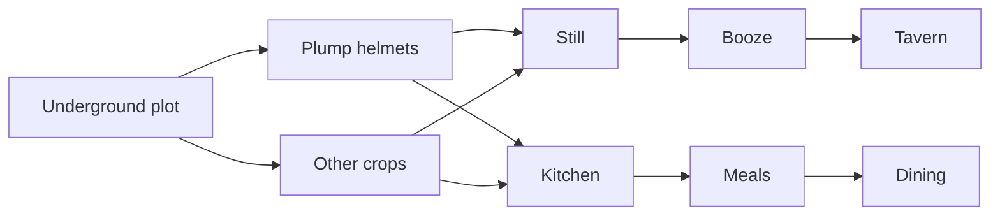

# Food and drink

The food and booze pipelines.

## Farming

> **TODO:** plot setup, irrigation if no soil, seasonal crops, seed management.

## Brewing

> **TODO:** still placement, barrel/large-pot supply, drink variety for happy thoughts.

## Cooking

> **TODO:** lavish meals, what *not* to cook (booze plants, seed plants).

!!! warning "Don't cook seeds"

    Cooking a plant destroys its seeds. Eat or brew the plant raw first; cook only the prepared products and meat.
