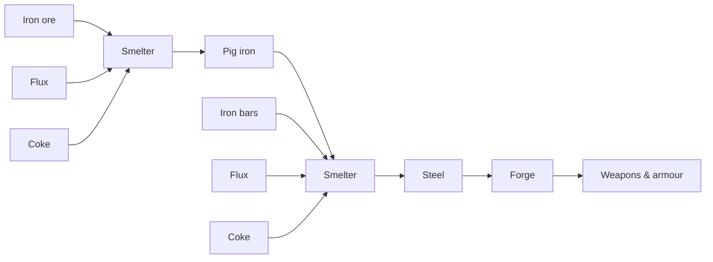

# Metal industry

## Prerequisites

> **TODO:** ore, fuel (charcoal or magma + coke), flux for steel, anvil, smelter, forge.

## Bronze, iron, steel

> **TODO:** ratios for steel production, magma forge benefits.

## What to forge

> **TODO:** military priority order — picks, axes, then armour, then weapons.
